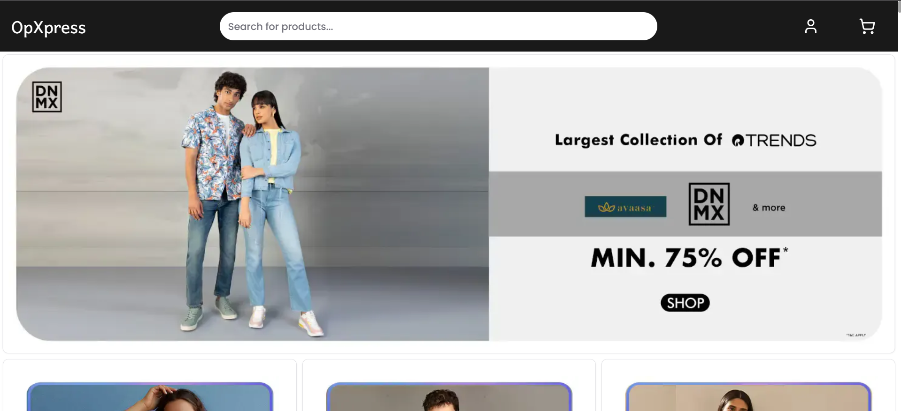
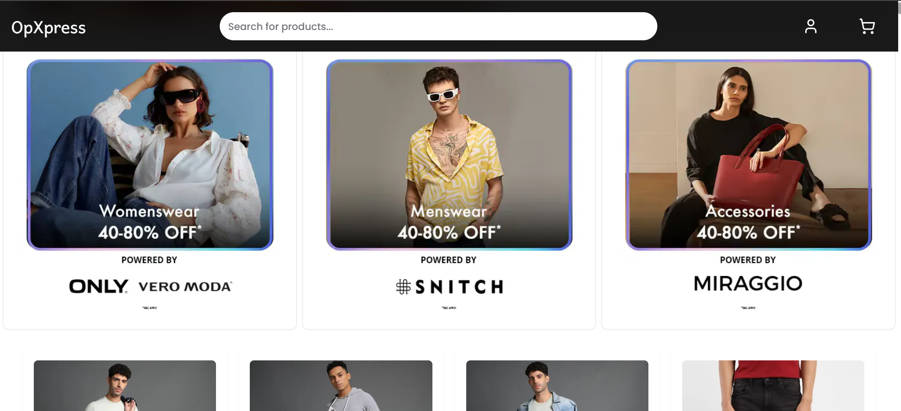
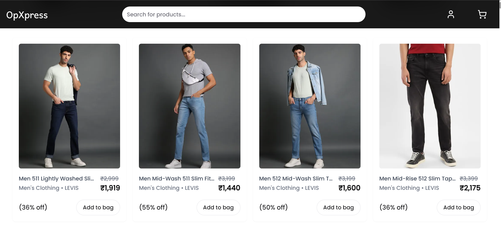
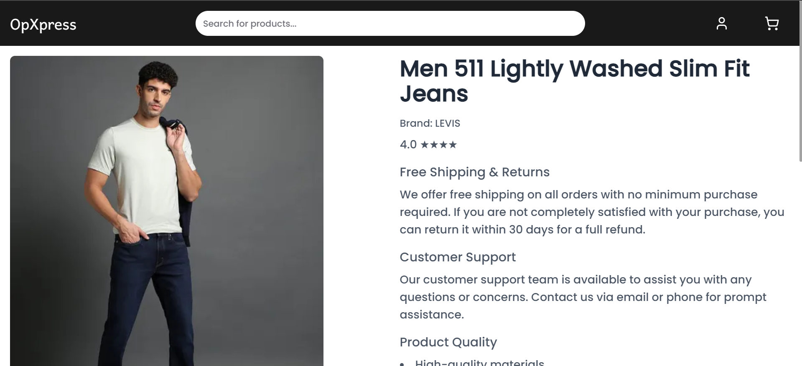
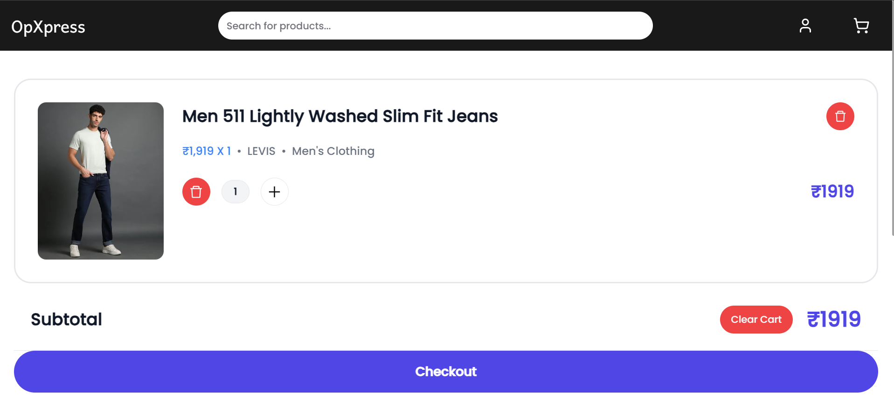
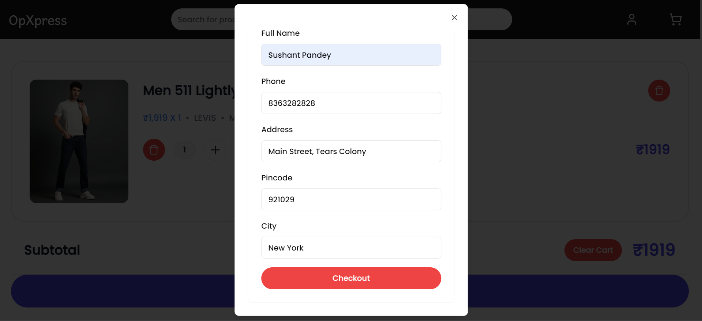
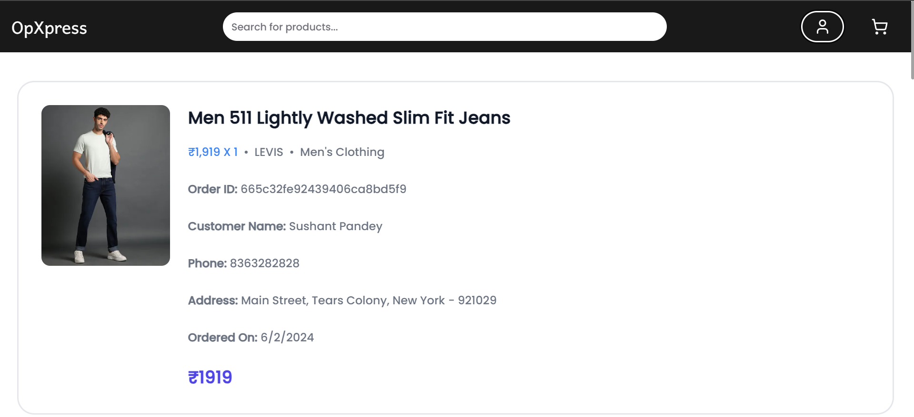
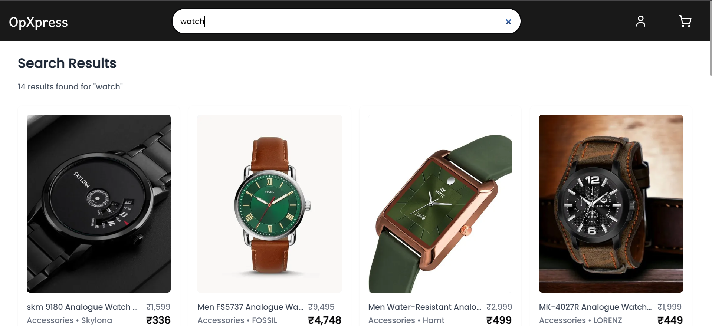
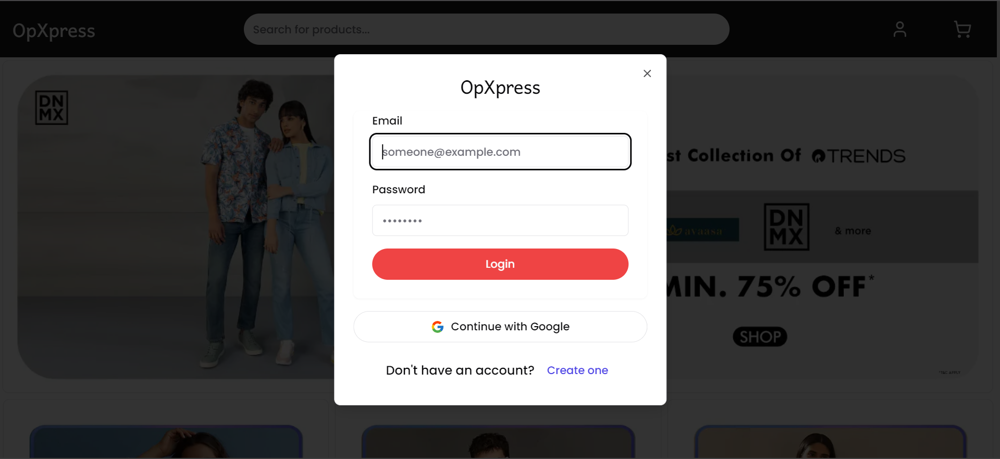
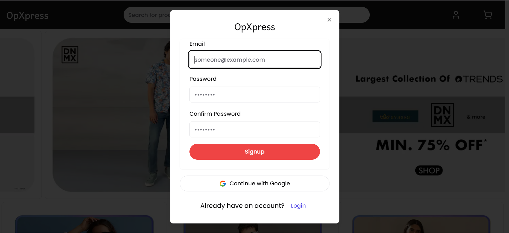

# OpXpress - Your Ultimate Destination for Quick and Easy Shopping

<p align="center">
  <a href="https://opxpress.sushant.fun">
    <picture>
      
    </picture>
    <h1 align="center">OpXpress</h1>
  </a>
</p>

## Links:

- **Deployment URL:** https://opxpress.sushant.fun

## About the App:

Discover a world of convenience with OpXpress! Shop for the latest trends, hottest deals, and must-have items all in one place. With our user-friendly interface and lightning-fast service, shopping has never been easier. Join the OpXpress community today and experience hassle-free shopping like never before!

## Technologies Used:

- **TypeScript:** A strongly typed programming language that builds on JavaScript, giving you better tooling at any scale.

- **Next.js:** A React.js framework for building fast, modern websites and web applications.

- **Redux Toolkit:** A library for managing application state, making it easier to write efficient and scalable code.

- **Tailwind CSS:** A utility-first CSS framework for quickly building custom user interfaces.

- **Shadcn:** A UI library to build responsive user interfaces.

- **Firebase:** A platform for building web and mobile applications, providing backend services such as authentication, database, and hosting.

- **Prisma ORM:** An open-source database toolkit that simplifies database access with an auto-generated and type-safe query builder, enabling seamless integration with TypeScript.

- **MongoDB:** A NoSQL database that provides flexible and scalable storage for various types of data, ensuring efficient data management for the application.

## Features:

- **Authentication:**
  Secure and seamless user authentication using Firebase, ensuring user data privacy and security.

- **Cart Management:**
  Efficient cart management system allowing users to add, remove, and update products in their cart effortlessly.

- **Products Showcase:**
  Attractive and organized display of a wide range of products with detailed descriptions and images.

- **Category-wise Filtering:**
  Advanced filtering options to help users easily find products based on categories, enhancing the shopping experience.

- **Order Storage in Database:**
  Robust order management system that stores individual user orders in the Firebase database for easy retrieval and tracking.

- **Responsive UI:**
  A highly responsive user interface built with Shadcn, Tailwind CSS, and other modern UI frameworks, ensuring a smooth shopping experience across all devices.

## Screenshots:

### Home Page

<div align="center">
  
</div>

<div align="center">
  
</div>

<div align="center">
  
</div>

### Product Page

<div align="center">
  
</div>

### Cart Page

<div align="center">
  
</div>

### Checkout

<div align="center">
  
</div>

### Orders Page

<div align="center">
  
</div>

### Search Results Page

<div align="center">
  
</div>

### Login

<div align="center">
  
</div>

### Signup

<div align="center">
  
</div>

## How to Run:

### **Clone the repository:**

```bash
git clone https://github.com/mskp/OpXpress-shopping-app
cd OpXpress-shopping-app
```

### **Install the dependencies:**

> Make sure you have `bun` installed.

```bash
bun i
```

### **Run the development server:**

```bash
bun dev
```

### **Build for production:**

```bash
bun run build
```

> Important Note: There is an .env.example file in the repository with sample variables required to run this project. These include Firebase credentials. Create a .env file in the root of the project and set these variables with proper values.

### Deployment

#### Deployment Steps

1. **Fork the Repository:** https://github.com/mskp/OpXpress-shopping-app
2. Create a Vercel account if you haven't already.
3. Once logged in, click on "New Project" in the Vercel dashboard.
4. Select "Import Git Repository" and connect your GitHub account if prompted.
5. Choose the forked repository (OpXpress-shopping-app) from your GitHub account.
6. Configure the project settings as needed.
7. Add environment variables (Firebase credentials) in the Vercel dashboard.
8. Click on "Deploy" and wait for the deployment process to complete.

#### Access the Deployed Application:

- Once deployed, the application will be accessible via the provided deployment URL.
- Users can visit the URL to access the OpXpress application.

### Developer Info:

- **Sushant Pandey**

  - GitHub: [https://github.com/mskp](https://github.com/mskp)
  - Email: sushhantpandey@gmail.com
  - LinkedIn: [https://linkedin.com/in/mskp](https://linkedin.com/in/mskp)
  - All Links: [https://linktr.ee/isushant](https://linktr.ee/isushant)
